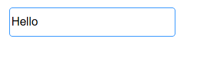
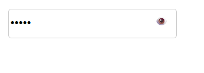
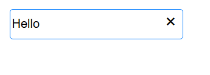
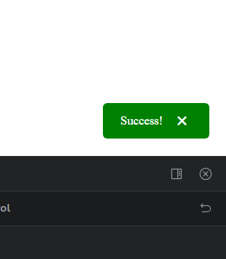
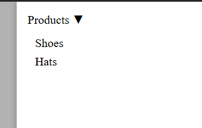
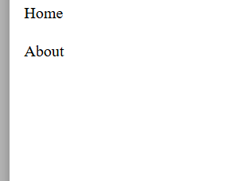

# Component Library

Minimal React component library with Storybook.

### Components:

1. **Input** – text input supporting types `text`, `password`, `number` with `clearable` option.  
2. **Toast** – toast notification with auto-dismiss and types `success`, `error`, `info`.  
3. **SidebarMenu** – sidebar menu with nested items and closes when clicking on the background.

## Screenshots

### Input Component

Text Input:  
  

Password Input:  
  

Clearable Input:  
  

### Toast Component

Success:  
  

Error:  
  

### SidebarMenu





---

## 📦 Installation

```bash
# Go to the project folder
cd component-library

# Install dependencies
npm install

# Run Storybook
npm run storybook
